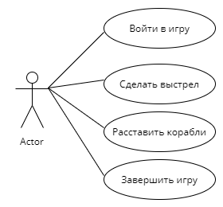

# Лабораторная работа 1
## Морской бой

### Войти в игру
- **Основной исполнитель:**  Игрок
- **Описание:** Игрок входит в игру и вводит свое имя
- **Предусловие:** Игра готова к запуску
- **Постусловие:** Имя игрока сохранено

**Основной сценарий:**

| Актор                   | Система                                             |
| ----------------------- | --------------------------------------------------- |
| 1. Входит в игру        |
| 2. Корректно вводит имя |
|                         | 3. Проверяет, ввел ли игрок имя, и не занято ли оно |
|                         | 4. Сохраняет имя игрока                             |

**Альтернативный сценарий:**

| Актор                                | Система                                             |
| ------------------------------------ | --------------------------------------------------- |
| 1. Входит в игру                     |                                                     |
| 2. Вводит пустое или уже занятое имя |                                                     |
|                                      | 3. Проверяет, ввел ли игрок имя, и не занято ли оно |
|                                      | 4. Просит игрока корректно ввести имя               |

### Расставить корабли
- **Основной исполнитель:** Игрок
- **Описание:** Расстановка кораблей
- **Предусловие:** Игра была начата
- **Постусловие:** Расстановка игрока сохраняется. 

**Основной сценарий:**

| Актор                                | Система                  |
| ------------------------------------ | ------------------------ |
| 1. Корректно расставляет все корабли |                          |
| 2. Нажимает "Сохранить"              |                          |
|                                      | 3. Проверяет расстановку |
|                                      | 4. Сохраняет расстановку |

**Альтернативный сценарий:**

| Актор                         | Система                                                 |
| ----------------------------- | ------------------------------------------------------- |
| 1. Расставляет не все корабли |                                                         |
| 2. Нажимает "Сохранить"       |                                                         |
|                               | 3. Проверяет расстановку                                |
|                               | 4. Просит пользователя корректно установить все корабли |

### Сделать выстрел
- **Основной исполнитель:** Игрок
- **Описание:** Игрок совершает выстрел
- **Предусловие:** Оба игрока расставили корабли
- **Постусловие:** Результат выстрела сохраняется и отображается на экране.

| Актор                                                | Система                                                                     |
| ---------------------------------------------------- | --------------------------------------------------------------------------- |
| 1. Нажимает на клетку, в которую он хочет выстрелить |                                                                             |
|                                                      | 2. Проверяет, попал ли игрок (Попал)                                        |
|                                                      | 3. Сохраняет результат выстрела и отмечает клетку желтым или красным цветом |
|                                                      | 4. Дает игроку возможность выстрелить еще раз                               |

**Альтернативный сценарий 1:**

| Актор                                                | Система                                                          |
| ---------------------------------------------------- | ---------------------------------------------------------------- |
| 1. Нажимает на клетку, в которую он хочет выстрелить |                                                                  |
|                                                      | 2. Проверяет, попал ли игрок (Не попал)                          |
|                                                      | 3. Сохраняет результат выстрела и отмечает клетку голубым цветом |
|                                                      | 4. Дает возможность передать ход другому игроку                  |

**Альтернативный сценарий 2:**

| Актор                                                | Система                                                                       |
| ---------------------------------------------------- | ----------------------------------------------------------------------------- |
| 1. Нажимает на клетку, в которую он хочет выстрелить |                                                                               |
|                                                      | 2. Проверяет, попал ли игрок (Попал и уничтожил последний корабль противника) |
|                                                      | 3. Отмечает клетку красным цветом и объявляет стрелявшего игрока победителем  |

### Закончить игру
- **Основной исполнитель:** Игрок
- **Описание:** При желании можно досрочно закончить игру
- **Предусловие:** Игра была начата
- **Постусловие:** Игра закончена

| Актор                               | Система                                                            |
| ----------------------------------- | ------------------------------------------------------------------ |
| 1. Нажимает кнопку "Закончить игру" |                                                                    |
|                                     | 2. Игра заканчивается, приложение переходит в начальное состояние. |