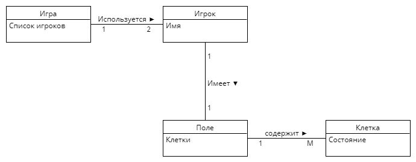

# Лабораторная 2

### Игрок - Игра
- При входе в игру игрок указывает свое имя.
- Игра рассчита на двух игроков.
### Игрок - Поле
- У каждого игрока есть одно поле для кораблей.
- Каждое поле принадлежит одному игроку.
### Поле - Клетка
- Поле состоит из множества клеток.
- Одна клетка находится на одном поле.