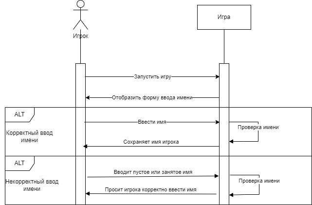
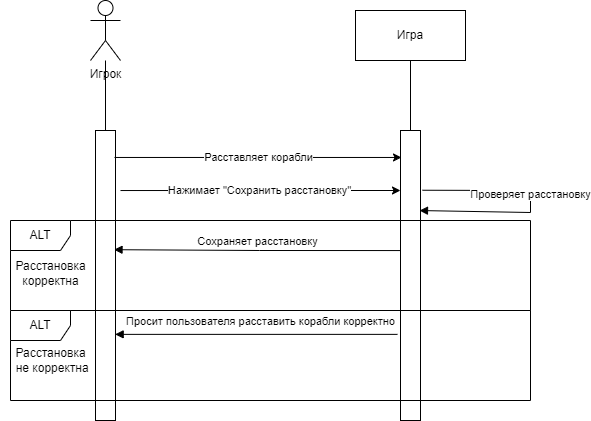
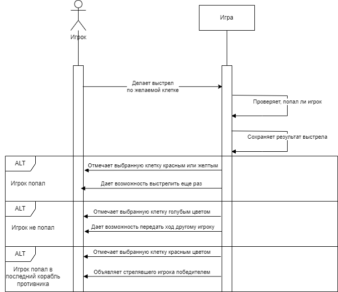
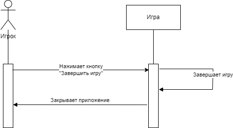

# Лабораторная работа 3
## Войти в игру

### Запуск игры
| Операция       | Запустить игру             |
|----------------|----------------------------------------|
| Ссылки         | Прецедент: Войти в игру                |
| Предусловие    | Приложение готово к запуску                   |
| Постусловие    | Игра запускается   |
### Ввод имени
#### Основной сценарий
| Операция       | Ввести имя             |
|----------------|----------------------------------------|
| Ссылки         | Прецедент: Войти в игру                |
| Предусловие    | Приложение запущено                    |
| Постусловие    | Имя игрока сохраняется   |

#### Альтернативный сценарий (некорректный ввод)
| Операция       | Ввести имя             |
|----------------|----------------------------------------|
| Ссылки         | Прецедент: Войти в игру                |
| Предусловие    | Приложение запущено                    |
| Постусловие    | Система просит игрока корректно ввести имя  |
## Расставить корабли

### Расставить корабли
#### Основной сценарий
| Операция       | Расставить корабли            |
|----------------|----------------------------------------|
| Ссылки         | Прецедент: Расставить корабли                |
| Предусловие    | Игра была начата                    |
| Постусловие    | Расстановка игрока сохраняется   |

#### Альтернативный сценарий (расстановка некорректна)

| Операция       | Расставить корабли            |
|----------------|----------------------------------------|
| Ссылки         | Прецедент: Расставить корабли                |
| Предусловие    | Игра была начата                    |
| Постусловие    | Система просит игрока расставить корабли по правилам |

## Сделать выстрел

#### Основной сценарий (игрок попал)
| Операция       | Делает выстрел            |
|----------------|----------------------------------------|
| Ссылки         | Прецедент: Сделать выстрел               |
| Предусловие    | Корабли обоих игроков расставлены                  |
| Постусловие    | Результат выстрела сохраняется. Игроку дается право выстрелить еще раз   |
#### Альтернативный сценарий (игрок  не попал)
| Операция       | Делает выстрел            |
|----------------|----------------------------------------|
| Ссылки         | Прецедент: Сделать выстрел               |
| Предусловие    | Корабли обоих игроков расставлены                  |
| Постусловие    | Результат выстрела сохраняется. Ход передается другому игроку  |

#### Альтернативный сценарий (игрок попал в последний корабль противника)
| Операция       | Делает выстрел            |
|----------------|----------------------------------------|
| Ссылки         | Прецедент: Сделать выстрел               |
| Предусловие    | Корабли обоих игроков расставлены                  |
| Постусловие    | Стрелявший игрок объявляется победителем   |

## Закончить игру

| Операция       | Нажать кнопку "Окончить игру"            |
|----------------|----------------------------------------|
| Ссылки         | Прецедент: Закончить игру              |
| Предусловие    | Игра была начата                  |
| Постусловие    | Игра завершается. Приложение закрывается. |