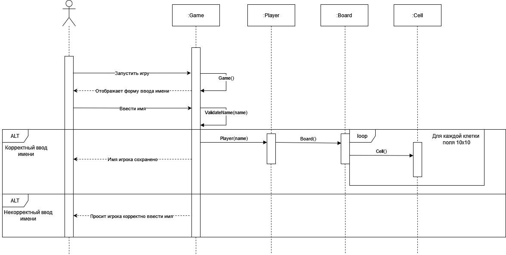
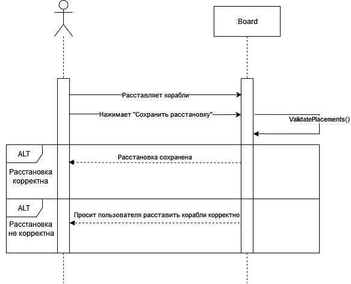
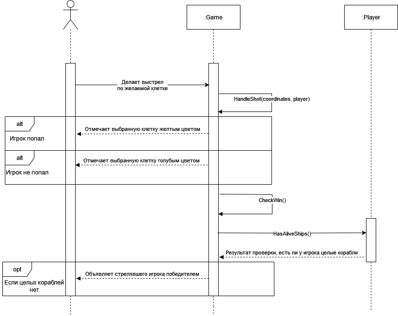
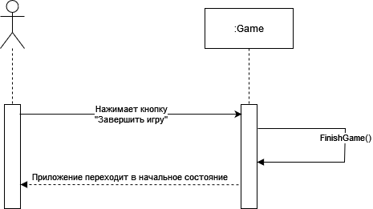

# Лабораторная работа 4
## Диаграммы взаимодействия
### Войти в игру

| Метод       | Game()                      |
| ----------- | --------------------------- |
| Описание    | Конструктор класса Game     |
| Ссылки      | Прецедент: Войти в игру     |
| Предусловие | Приложение готово к запуску |
| Постусловие | Игра создается              |

| Метод       | ValidateName(name)                 |
| ----------- | ---------------------------------- |
| Описание    | Проверка корректности имени игрока |
| Ссылки      | Прецедент: Войти в игру            |
| Предусловие | Игрок ввел имя                     |
| Постусловие | Имя проверено                      |

| Метод       | Player(name)              |
| ----------- | ------------------------- |
| Описание    | Конструктор класса Player |
| Ссылки      | Прецедент: Войти в игру   |
| Предусловие | Введено корректное имя    |
| Постусловие | Создается объект игрока   |

| Метод       | Board()                        |
| ----------- | ------------------------------ |
| Описание    | Конструктор класса Board       |
| Ссылки      | Прецедент: Войти в игру        |
| Предусловие | Введено корректное имя         |
| Постусловие | Создается объект игрового поля |

| Метод       | Cell()                  |
| ----------- | ----------------------- |
| Описание    | Конструктор класса Cell |
| Ссылки      | Прецедент: Войти в игру |
| Предусловие | Введено корректное имя  |
| Постусловие | Создается объект клетки |

### Расставить корабли

| Метод       | ValidatePlacements()                   |
| ----------- | -------------------------------------- |
| Описание    | Проверка корректности расстановки      |
| Ссылки      | Прецедент: Расставить корабли          |
| Предусловие | Игрок попробовал сохранить расстановку |
| Постусловие | Расстановка проверена на корректность  |
### Сделать выстрел

| Метод       | HandleShot(coordinates, player)            |
| ----------- | ------------------------------------------ |
| Описание    | Обработка выстрела                         |
| Ссылки      | Прецедент: Сделать выстрел                 |
| Предусловие | Игрок сделал выстрел                       |
| Постусловие | Результаты выстрела обработаны и сохранены |

| Метод       | СheckWin()                              |
| ----------- | --------------------------------------- |
| Описание    | Проверка, победил ли игрок              |
| Ссылки      | Прецедент: Сделать выстрел              |
| Предусловие | Результат выстрела обработан            |
| Постусловие | Проверка наличия победителя произведена |

| Метод       | HasAliveShips()                             |
| ----------- | ------------------------------------------- |
| Описание    | Проверка наличия у игрока целых кораблей    |
| Ссылки      | Прецедент: Сделать выстрел                  |
| Предусловие | Результат выстрела обработан                |
| Постусловие | Проверка наличия целых кораблей произведена |

### Завершить игру

| Метод       | FinishGame()                               |
| ----------- | ------------------------------------------ |
| Описание    | Метод возвращает игру в исходное состояние |
| Ссылки      | Прецедент: Завершить игру                  |
| Предусловие | Нажата кнопка "Завершить игру"             |
| Постусловие | Игра возвращается в исходное состояние     |