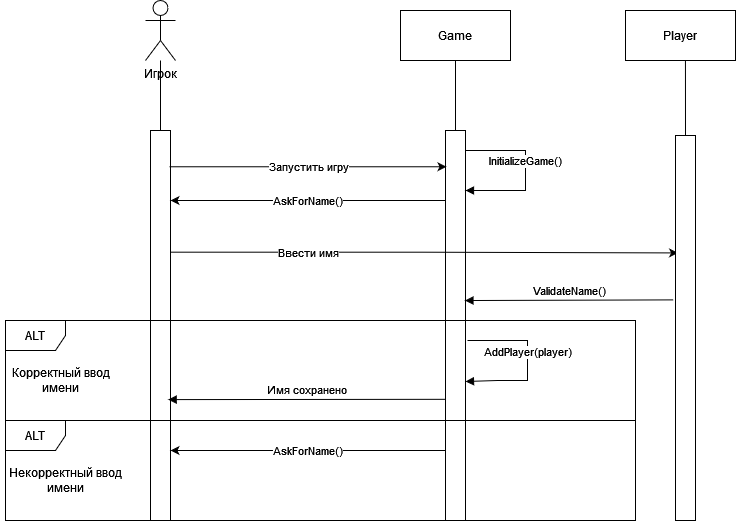
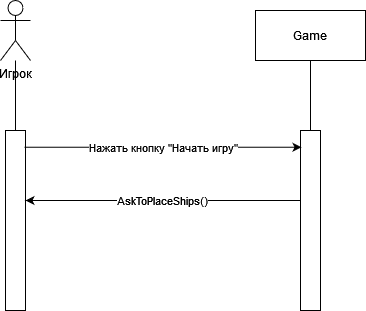
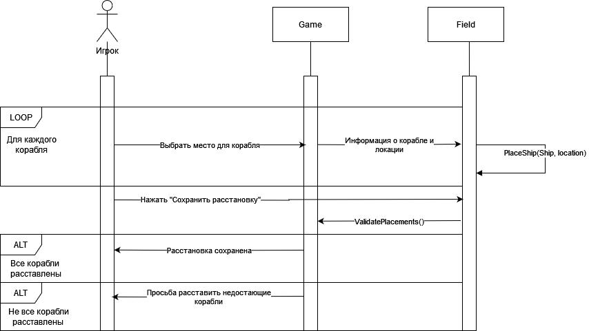
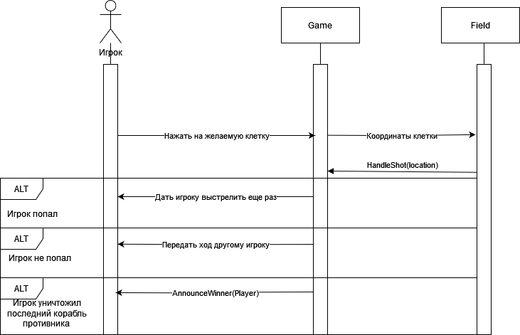
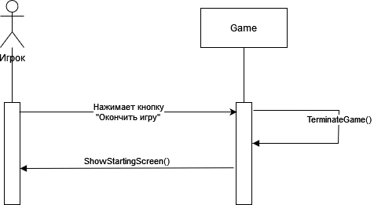

# Лабораторная работа 3

## Войти в игру

| Операция    | InitializeGame()            |
|-------------|-----------------------------|
| Описание    | Инициализация игры          | 
| Ссылки      | Прецедент: Войти в игру     |
| Предусловие | Игра была запущена          |
| Постусловие | Игра готова к использованию |

| Операция    | AskForName()                |
|-------------|-----------------------------|
| Описание    | Получение имени игрока      | 
| Ссылки      | Прецедент: Войти в игру     |
| Предусловие | Игра готова к использованию | 

| Операция    | ValidateName()                |
|-------------|-------------------------------|
| Описание    | Проверка имени                | 
| Ссылки      | Прецедент: Войти в игру       |
| Предусловие | Игрок ввел имя                |
| Постусловие | Имя проверено на корректность |

| Операция    | AddPLayer()                    |
|-------------|--------------------------------|
| Описание    | Сохранение игрока              | 
| Ссылки      | Прецедент: Войти в игру        |
| Предусловие | Введенное имя игрока корректно |
| Постусловие | Имя игрока сохранено           |

## Начать игру

### Начать игру

| Операция    | AskToPlaceShips()                       |
|-------------|-----------------------------------------|
| Описание    | Начало игры. Просьба расставить корабли | 
| Ссылки      | Прецедент: Начать игру                  |
| Предусловие | Два игрока ввели имена                  |
| Постусловие | Открывается экран расстановки кораблей  |

## Расставить корабли

| Операция    | PlaceShip(Ship, location)       |
|-------------|---------------------------------|
| Описание    | Сохранение расположения корабля | 
| Ссылки      | Прецедент: Расставить корабли   |
| Предусловие | Игрок указал место              |
| Постусловие | Расположения корабля сохранено  |

| Операция    | ValidatePlacements()                  |
|-------------|---------------------------------------|
| Описание    | Проверка, все ли корабли расставлены  | 
| Ссылки      | Прецедент: Расставить корабли         |
| Предусловие | Игрок попытался сохранить расстановку |
| Постусловие | Расстановка проверена                 |

## Сделать выстрел

| Операция    | HandleShot(location)             |
|-------------|----------------------------------|
| Описание    | Обработка выстрела               |
| Ссылки      | Прецедент: Сделать выстрел       |
| Предусловие | Игрок нажал на клетку противника |
| Постусловие | Результат выстрела сохранен      |

| Операция    | AnnounceWinner(Player)                   |
|-------------|------------------------------------------|
| Описание    | Объявление победителя                    |
| Ссылки      | Прецедент: Сделать выстрел               |
| Предусловие | Уничтожены все корабли одного из игроков |
| Постусловие | Победитель объявлен, игра завершена      |

## Закончить игру

| Операция    | TerminateGame()           |
|-------------|---------------------------|
| Описание    | Досрочное завершение игры | 
| Ссылки      | Прецедент: Закончить игру |
| Предусловие | Игра была начата          |
| Постусловие | Игра завершается          |

| Операция    | ShowStartingScreen()         |
|-------------|------------------------------|
| Описание    | Показать начальный экран     | 
| Ссылки      | Прецедент: Закончить игру    |
| Предусловие | Игру досрочно завершили      |
| Постусловие | Отображается начальный экран |